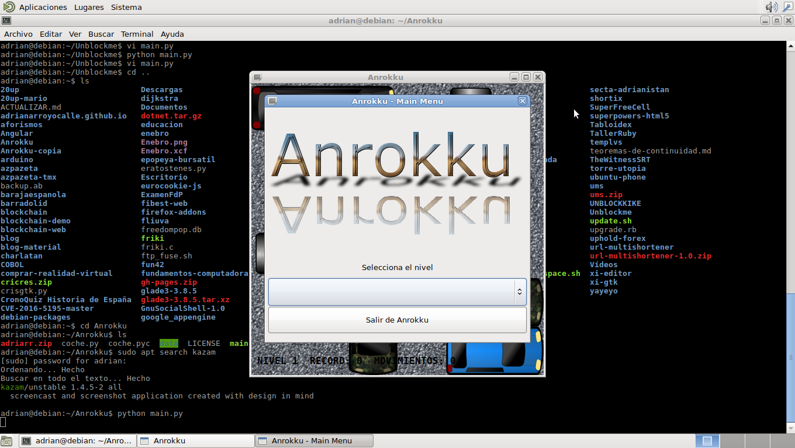
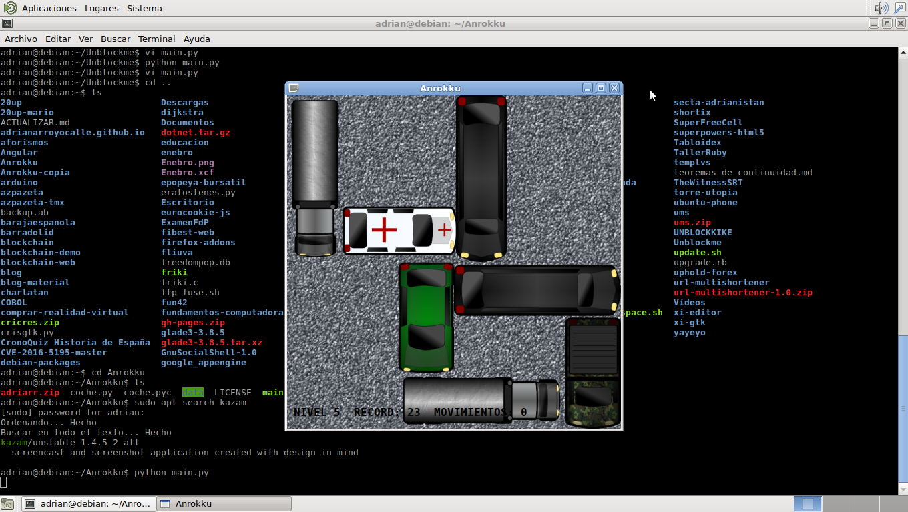

# Anrokku
Anrokku is a free game made in Python 2.7 and GTK2





## Dependencies

Anrokku requires:

* Python 2.7
* GTK 2.0
* PyGTK
* Cairo

It should be easy to install it on your operating system

## PLAY

```
git clone http://github.com/AdrianArroyoCalle/Anrokku
cd Anrokku
python main.py
```
